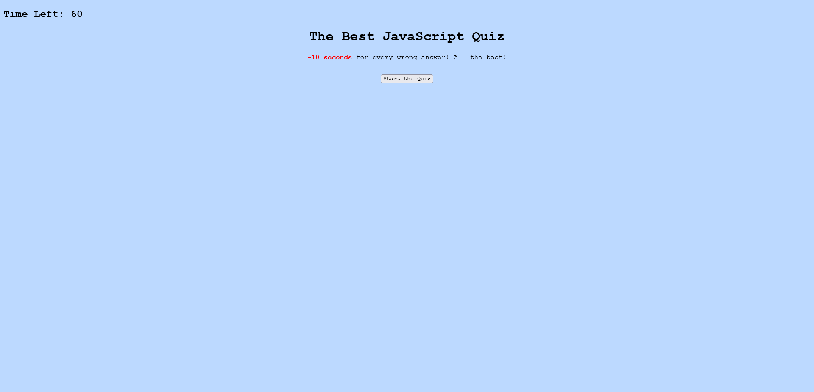
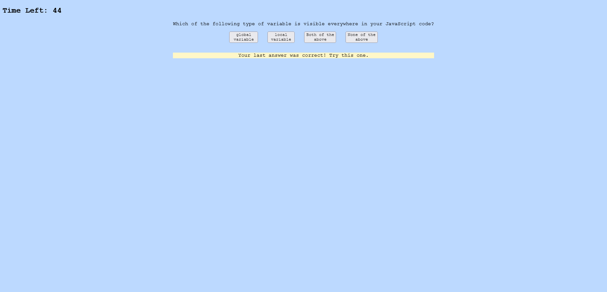
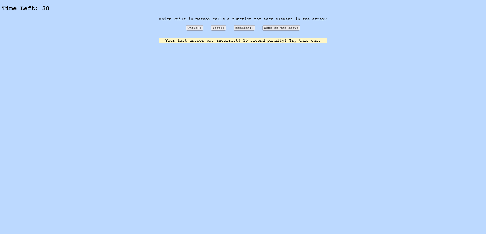

# Code Quiz
### This is a timed coding quiz with multiple-choice questions. This app will run in the browser and will feature dynamically updated HTML and CSS powered by JavaScript code.
<br/>

## **What is the User Story?**
```
AS A coding boot camp student
I WANT to take a timed quiz on JavaScript fundamentals that stores high scores
SO THAT I can gauge my progress compared to my peers
```
<br/>

## **What has been coded?**
* HTML - made containers for main menu, questions & answers and highscores.
* CSS - Used custom CSS.
* JS - Used local storage, array and object concepts.
<br/>

<br/>

## **Code Quiz Page**

### Main Menu


### When user chooses the correct answer


### When user chooses the wrong answer (10 second penalty)


### After the quiz, user can save his/her/their score


### Highscores

<br/>

### Click [here](https://nevan-dsouza.github.io/coding-quiz/) to view the page
<br/>